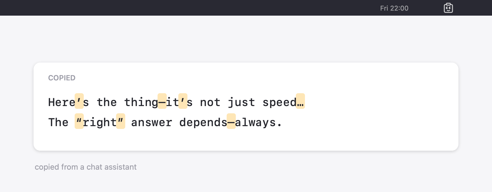

<h1 align="center">PasteBop</h1>

<p align="center">
  <em>Copied text, straightened out &mdash; and an opinion about where it came from.</em>
</p>

<p align="center">
  
</p>

PasteBop is a macOS menu bar app that watches the clipboard and rewrites
typographic and invisible characters into the ones on your keyboard. Copy
something from a chat assistant, a Google Doc or a PDF, paste it into a
terminal, a code editor or a commit message, and it is already clean.

```
“It’s fine,” she said—then paused… café «naïve» ≈ 3×4 → 12 OK​.
"It's fine," she said--then paused... café "naïve" ~ 3x4 -> 12 OK.
```

Accented letters, emoji, CJK text and rich-text formatting are left exactly as
they were. Only the 258 characters in the table below are touched.

---

## Install

Download the latest `.dmg` from [Releases](https://github.com/neuroo/pastebop/releases)
and drag PasteBop to Applications.

Releases are **ad-hoc signed**, not notarised, so Gatekeeper blocks the first
launch. Either right-click PasteBop and choose **Open**, or run:

```bash
xattr -dr com.apple.quarantine /Applications/PasteBop.app
```

Requires macOS 14 or later, on Apple silicon.

## Using it

PasteBop lives in the menu bar and has two switches:

- **Enable PasteBop** — when off, the poll timer is torn down entirely, so a
  disabled PasteBop costs nothing at all.
- **Start at Login** — registered through `SMAppService`, so it shows up under
  Login Items in System Settings like any other app.

Below them is a **Statistics** submenu with what has actually been fixed:

```
Cleaned 1,204 characters in 168 copies
Statistics ▸  Since 11 Sep 2026
              Mostly quotes and apostrophes (46%)
              ───
              312 × Right single quotation mark ’
              198 × Em dash —
               96 × Horizontal ellipsis …
               41 × No-break space
              ───
              Reset Statistics
```

**About PasteBop** opens a Help window with the full table and a **Try it**
button that copies a messy sample so you can watch it get cleaned.

## Where did this text come from?

PasteBop already counts every em dash, curly quote and ellipsis it rewrites,
which turns out to be most of a fingerprint. So it tells you:

```
Cleaned 47 characters in this copy
╰─ Reads machine-written (curly quotes, em dashes, ellipses)
```

What it actually measures is typographic polish, and a word processor produces
plenty of that on its own — so the discriminator is **variety**, not volume.
Smart quotes alone are Pages or Word, and it says `Reads word-processed`.
Quotes *and* em dashes *and* ellipses together are the house style of a chat
assistant. Below 240 characters it says nothing, because the density of a
tweet means nothing.

The lifetime total moves into the Statistics submenu, which adds the share
once ten copies have gone by:

```
Cleaned 4,102 characters in 812 copies
63% of it read as machine-written
```

This reads a handful of integers that were counted anyway. **No text is
examined, stored, or sent anywhere** — there is no network call and nothing to
opt out of. It is a heuristic, and it is wrong about hand-written prose from
someone who likes em dashes.

## Customising the rules

Every rule lives in a file you can edit:

```
~/Library/Application Support/PasteBop/rules.yaml
```

It is written with the built-in table on first launch, grouped and commented,
and **saving it applies immediately** — no restart. **Rules ▸ Edit Rules…**
in the menu opens it.

```yaml
version: 1

rules:
  # Dashes and hyphens
  U+2013: "-"       # –  EN DASH
  U+2014: "--"      # —  EM DASH
  U+E0000..U+E007F: ""   # TAG CHARACTERS
```

The file *is* the table: delete a line and that character is left alone, add
one and it starts being rewritten. Replacements must be quoted, and `""`
deletes the match. A key is one of:

| Key | Matches |
| --- | --- |
| `U+2014` | one character |
| `U+E0000..U+E007F` | every character in a range |
| `U+0020 U+2014 U+0020` | that exact substring, written as scalars |
| `" — "` | that exact substring, written literally |

```yaml
  " — ": " - "            # spaced em dash, collapsed
  U+200B U+200B: ""       # doubled zero-width spaces, removed
```

Substrings are matched longest-first and beat a single-character rule for the
same first character. The scalar form is the only way to write something
invisible; the literal form is easier for everything else. Anything PasteBop
does not recognise is grouped under **Custom** in the Help window.

A rule for a single ASCII character is refused rather than accepted and
ignored: the scanner skips ASCII without looking, which is where its speed
comes from. An ASCII-*leading* substring (`"<--"`) is fine and takes a
slightly slower path only while such a rule exists.

A file that does not parse never breaks the app: the last rules that worked
stay in force and the menu says which line is wrong. Deleting the file
restores the defaults, as does **Rules ▸ Restore Default Rules**.

The format is a deliberately small subset of YAML, parsed in-process rather
than by a YAML library, so PasteBop keeps its zero third-party dependencies.
Every rejection names the line and says what it expected. The file is treated
as untrusted input: it is capped at 4 MB, 10,000 rules, 64 characters per
substring and 256 per replacement, and the parser and scanner are fuzzed in
the test suite.

## Updates

PasteBop checks GitHub for a newer release once a week, and on demand from
**Check for Updates…**. It does not install anything: distribution is ad-hoc
signed, and silently swapping in a binary you never chose to download is
precisely what code signing exists to prevent. A newer release opens the
release page; you decide.

The weekly check is quiet unless there is something to say, and never mentions
the same release twice. It remembers when it last looked in:

```
~/Library/Application Support/PasteBop/update-state.json
```

Plain ISO 8601 JSON — delete it to forget, or set `lastCheck` forward to
postpone. Update checks need the repository to be public; against a private
one GitHub returns 404 and PasteBop says so.

## What it rewrites

<!-- Generated by: swift test --filter "Rewrite table as Markdown" -->

| Family | Characters | Becomes |
| --- | --- | --- |
| Quotes and apostrophes (34) | ‘ ’ ‚ ‛ “ ” „ ‟ « » ‹ › ′ ″ ´ ʼ ˝ ❛ ＂ | `'` `"` |
| Dashes and hyphens (12) | ‐ ‑ ‒ – — ― − ⸺ ⸻ ﹘ ﹣ － | `-` `--` `---` `----` |
| Punctuation (12) | ․ ‥ … ⋯ ‼ ‽ ⁇ ⁈ ⁉ ⁄ ‖ ‗ | `.` `..` `...` `!!` `?!` `??` `/` |
| Spaces (16) | no-break, thin, hair, figure, ideographic | a plain space |
| Invisible characters (157) | zero-width, bidi overrides, tag block, BOM, soft hyphen | removed |
| List bullets (11) | • ‣ ⁃ ∙ ▪ ▫ ▸ ▹ ○ ● ◦ | `-` |
| Math and arrows (16) | × ÷ ± ∕ ∖ ∗ ≈ ≠ ≤ ≥ ← → ↔ ⇐ ⇒ ⇔ | `x` `/` `+/-` `~` `!=` `<=` `->` `=>` |

### What it deliberately leaves alone

Being conservative matters more than being thorough — a wrong rewrite corrupts
someone's text silently.

| Kept | Why |
| --- | --- |
| `é ñ ü ç ø å ß` and every other accented letter | typable on international layouts |
| `© ® ™ § ¶ ° € £` | intentional symbols, not typographic residue |
| `U+200C` ZWNJ, `U+200D` ZWJ | load-bearing in Persian and Hindi, and in emoji like 👨‍👩‍👧 |
| `U+200E` LRM, `U+200F` RLM | real formatting in mixed right-to-left text |
| `。、「」` and fullwidth forms | correct CJK punctuation |
| `·` middle dot | a letter in Catalan (`l·l`) |
| `U+FFFD` replacement character | it signals data loss, so it should stay visible |

The bidi characters it *does* delete are the embeddings, overrides and isolates
(`U+202A`–`U+202E`, `U+2066`–`U+2069`) used in
[Trojan Source](https://trojansource.codes) attacks, plus the entire invisible
tag block (`U+E0000`–`U+E007F`) used to smuggle hidden instructions into copied
text.

## How it behaves

**Rich text.** When you copy from a browser or Word, the clipboard carries
HTML and RTF next to the plain text. PasteBop rewrites all of them, so the
result is the same wherever you paste:

- **RTF/RTFD** is decoded, its characters rewritten, and re-encoded with every
  font, colour and style run preserved.
- **HTML** is split into markup and text, and *only text nodes* are rewritten.
  Attribute values, comments and `<script>`/`<style>` bodies are untouched —
  turning `«` into `"` inside `title="«x»"` would break the attribute. Markup
  characters a rule produces are escaped, so `←` becomes `&lt;-` rather than an
  accidental tag.
- Images, files, and any flavour PasteBop does not understand are copied
  through byte for byte.

**Passwords.** Items tagged `org.nspasteboard.ConcealedType` or
`org.nspasteboard.TransientType` — what password managers set — are never
touched, so PasteBop cannot mangle a password or defeat an auto-clear.

**Data loss.** If any flavour on the clipboard cannot be read back, PasteBop
leaves the whole clipboard alone rather than risk dropping it. Losing a
promised file is worse than leaving a curly quote.

**Universal Clipboard.** The rewritten text syncs to your other devices
normally. One gap: `clearContents()` cannot preserve an app's
`.currentHostOnly` flag, so content marked local-only could be re-broadcast.
In practice apps that set it also set `ConcealedType`, which PasteBop skips.

## Performance

There is no notification for pasteboard changes, so PasteBop polls
`changeCount` every 250 ms on a coalesced timer — an integer read that costs
nothing until it moves.

The scanner walks UTF-8 bytes rather than `Character`s: ASCII is rejected with
a single compare, unchanged stretches are copied as raw memory, and lookups go
through dense arrays per Unicode block with a page bitmap in front of the long
tail. Measured on an M-series laptop with:

```bash
PASTEBOP_BENCHMARK=1 swift test -c release --filter Throughput
```


| Input | Throughput |
| --- | --- |
| Pure ASCII (source code, logs, URLs) | 2 900 MB/s |
| Accented prose, nothing to fix | 2 500 MB/s |
| AI prose with typographic marks | 550 MB/s |
| CJK, nothing to fix | 260 MB/s |
| Every character a rewrite | 160 MB/s |

A typical clipboard is a few kilobytes, so a pass costs microseconds against a
250 ms budget.

## Linting

`swiftlint lint --strict` must report zero. The configuration is in
[.swiftlint.yml](.swiftlint.yml); the dead-code rules need a compiler log and
run as their own CI job:

```bash
swift build --build-tests -v > /tmp/build.log 2>&1
swiftlint analyze --strict --compiler-log-path /tmp/build.log
```

## Building

No Xcode project: the package builds a plain executable and a script wraps it
in a bundle.

```bash
swift test                 # 122 tests, about 0.1s
swiftlint lint --strict    # must be zero
Scripts/build-app.sh       # arm64, ad-hoc signed, to dist/PasteBop.app
Scripts/package.sh         # .dmg (laid out for drag-install) and .zip
open dist/PasteBop.app
```

| Path | What it is |
| --- | --- |
| `Sources/PasteBopCore` | the rewrite table, scanner, and pasteboard handling — all the testable logic |
| `Sources/PasteBop` | the menu bar app: SwiftUI `MenuBarExtra`, clipboard monitor, login item |
| `App/` | `Info.plist`, asset catalog, icon set |
| `Scripts/` | build, package, version, icon generation |
| `img/` | source artwork |
| `App/dmg/` | disk image background and the committed Finder window layout |
| `CLAUDE.md`, `.claude/skills/` | the invariants, and how to release, benchmark and change the table |

`Sources/PasteBopCore/Replacements.swift` is the single source of truth for
the defaults. Everything else — the lookup structures, the Help window, the
rules file written on first launch — is derived from it, and tests assert the
invariants the fast path depends on: no duplicates, every rule above the ASCII
floor, every replacement typable ASCII, no replacement that reintroduces a
rewritten character. The parser and the scanner are also fuzzed against seeded
garbage, which must never produce a crash or an unexpected error type.

To regenerate the icons after changing the artwork:

```bash
swift Scripts/make-icons.swift
```

## Releasing

Versions are dates: `2026.09.11`, with a fourth component for a second release
the same day (`2026.09.11.2`). `CFBundleVersion` is the zero-padded
`YYYYMMDDNN`, which always increases.

```bash
Scripts/bump-version.sh
git commit -am "Release $(cat VERSION)"
git tag "v$(cat VERSION)"
git push --follow-tags
```

Pushing the tag runs `.github/workflows/release.yml`, which tests, builds,
packages, and publishes the release. It refuses to run if the `VERSION` file
and the tag disagree.

Every GitHub Action is pinned to a full commit SHA with the version as a
trailing comment, because a tag is mutable. Dependabot bumps both weekly. The
Swift package has no third-party dependencies.

The workflows are least-privilege (`contents: read`, raised to `write` only on
the job that publishes), never interpolate untrusted input into a shell, and
check out with `persist-credentials: false`. They are kept clean under
[actionlint](https://github.com/rhysd/actionlint) and
[zizmor](https://docs.zizmor.sh):

```bash
brew install actionlint zizmor
actionlint && zizmor --persona=pedantic .github/workflows/
```

### Signing

Releases are ad-hoc signed by default. Add these repository secrets and the
workflow signs and notarises instead, with no other changes:

| Secret | What it is |
| --- | --- |
| `DEVELOPER_ID_P12` | base64 of the exported *Developer ID Application* `.p12` |
| `DEVELOPER_ID_P12_PASSWORD` | the password you set when exporting it |
| `NOTARY_APPLE_ID` | Apple ID for notarisation |
| `NOTARY_TEAM_ID` | your 10-character team ID |
| `NOTARY_PASSWORD` | an app-specific password |

## License

MIT. See [LICENSE](LICENSE).
